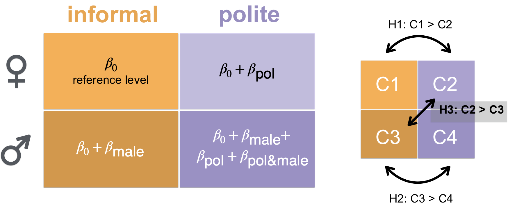

# Bayesian Regression Models using BRMS {#brms}

```{r libraries, warning=FALSE, message=FALSE}
library(tidyverse)
library(lme4) # frequentist linear mixed-effects models
library(brms) # Bayesian regression models
library(HDInterval) # credible interval computation (highest posterier density)
```

## What is BRMS?

BRMS is an R package for Bayesian statistical analysis developed by Paul Buerkner [@burkner2017brms]. It stands for Bayesian Regression Models using Stan. Stan is a probabilistic programming language developed by a team of programmers and statisticians headed by Andrew Gelman at Columbia University. It allows for developing Bayesian statistical models. BRMS provides an easy to use R interface to Stan so that instead of writing Stan code, we write our models in the familiar `lme4` langauge. BRMS translates our R code to Stan and brings back the results.

## Continuous DV

Main Questions:

  * Does voice pitch differ across female and male speakers? 
  * How much does it depend on the social context?

We use the data provided by Franke and Roettger:

```{r import_data}
politedata <- read.csv("https://raw.githubusercontent.com/michael-franke/bayes_mixed_regression_tutorial/master/code/politeness_data.csv")

head(politedata)
```

Always a good idea to look at the summary of the data:

```{r}
summary(politedata)
```

Let's plot the data:

```{r politdata_plot}
ggplot(politedata, aes(gender, pitch, fill=context)) + 
  geom_boxplot() + # create boxplots
  stat_summary(fun.y=mean, 
               geom="point", 
               position = position_dodge(width=0.75), 
               shape=3, 
               size=4, 
               color="red") + # add the mean value to the boxplot
  geom_jitter(color="grey") + # add invidual data points with jitter so that we can see them
  theme_classic()
```

We will consider 3 hypotheses:

  * $H_1$: Female speakers have a lower average pitch in polite than in informal contexts.
  
  * $H_2$: Male speakers have a lower average pitch in polite than in informal contexts.
  
  * $H_3$: Male speakers have a lower average pitch in informal than female speakers have in polite contexts.



### Fixed-effects Model

Let's start with a simple fixed-effects frequentist regression model using the function `lm` in R.

```{r lme4Model_FE}
lme4Model_FE <- lm(pitch~ gender * context, data = politedata)

summary(lme4Model_FE)
```

The model shows that pitch is significantly lower for male speakers in an informal context than female speakers in an informal context. A contrast we were not interested in. The model also shows that pitch is significantly lower in a polite context than informal context for female speakers. This is our first hypothesis ($H_1$). Finally the model shows that there is no significant interaction between context and gender.

Let's do the same thing the Bayesian way, using `brms`:

```{r BaysModel_FE}
# run regression model in brms
BaysModel_FE <- brm(
  formula = pitch ~ gender * context,
  data = politedata,
  family = "gaussian"
#  file = "models/BaysModel_FE"
)

# print out model_FE summary
BaysModel_FE
```

As you can see the results are very similar. With Bayesian models, it is important to look at the posterior distribution of our parameters, and most importantly, the trace plots of the chains to make sure they have converged.

```{r tracePlots_PosteriorHistograms}
plot(BaysModel_FE)
```

We can also extract the posterior samples from our model:

```{r posterior_samples}
# extract posterior samples
post_samples_FE <- posterior_samples(BaysModel_FE)
head(post_samples_FE %>% round(1))
```

Using posterior samples, we can estimate the probability of the hypotheses we are interested in. Let's consider $H_1$: Female speakers have a lower average pitch in polite than in informal contexts. Our model estimates female pitch in the informal context as its intercept ($\beta_0$). It estimates female pitch in polite context as $\beta_0 + \beta_{pol}$.  Therefore, asking our model whether politeness lowers pitch in females is similar to asking if $\beta_{pol}$ is negative ($\beta_{pol} < 0$). We are not interested in a particular sample estimate but rather, across samples, how likely is that polite context has a negative contribution? ($P(\beta_{polite} < 0 | model, data)$). We can estimate the answer using the proportion of negative samples for the politeness parameter:

```{r}
mean(post_samples_FE$b_contextpol < 0)
```

Now consider $H_2$: Male speakers have a lower average pitch in polite than in informal contexts.

Consider $H_3$: Male speakers have a lower average pitch in informal than female
speakers have in polite contexts. In our model, male pitch in informal contexts is $\beta_{0}+ \beta_{male}$ and female pitch in polite context was $\beta_{} + \beta_{pol}$. Therefore, hypothesis 3 boils down to: $\beta_{pol} > \beta_{male}$? And of course we are not interested in one particular instance of it. We want to know how likely it is that $H_3$ is true. In other words, we are interested in $P(\beta_{polite} > \beta_{male})$. We can estimate this probability by computing the proportion of times that this inequality holds in the posterior samples:

```{r}
mean(post_samples_FE$b_contextpol > post_samples_FE$b_genderM)
```

Michael Franke's R package allows easy comparison between cells. First let's install and load it:

```{r install_faintR}
library(devtools)

# install package with convenience function for Bayesian regression models for factorial designs from GitHub
#install_github(
#  repo = "michael-franke/bayes_mixed_regression_tutorial",
#  subdir = "faintr")

# load the just installed package
library(faintr)
```

The function `compare_groups` takes predictor levels and returns their mean difference, the probability of their difference being more than 0, and its credible interval. 

```{r}
# compare cell means with each other
compare_groups(
  model = BaysModel_FE,
  lower = list(gender = "M", context = "inf"),
  higher = list(gender = "F", context = "pol")
)
```

```{r posterior_beliefs_function}
get_posterior_beliefs_about_hypotheses = function(model) {
  # insert the comparisons you are interested in as strings 
  tibble(
    hypothesis = c("Female-polite < Female-informal", 
                   "Male-polite < Male-informal",
                   "Male-informal < Female-polite"),
    probability = c(
      # insert the comparisons you are interested in referring to the extracted samples
      compare_groups(
        model = model, 
        lower = list(gender = "F", context = "pol"), 
        higher = list(gender = "F", context = "inf")
      )$probability,
      compare_groups(
        model = model, 
        lower = list(gender = "M", context = "pol"), 
        higher = list(gender = "M", context = "inf")
      )$probability,
      compare_groups(
        model = model, 
        lower = list(gender = "M", context = "inf"),
        higher = list(gender = "F", context = "pol")
      )$probability 
    )
  )
}

get_posterior_beliefs_about_hypotheses(BaysModel_FE)
```

### Random Effects Models

```{r lme4Model_RE_maximal}
lme4Model_RE <- lmer(pitch ~ gender*context + 
                       (1 + gender * context | sentence) + 
                       (1 + context| subject), 
                     data = politedata)

summary(lme4Model_RE)
```

```{r chekcing_singularity}
isSingular(lme4Model_RE)
```

```{r BaysModel_RE_max}
BaysModel_MaxRE <- brm(formula = pitch ~ gender * context +
                    (1 + gender * context | sentence) +
                    (1 + context | subject),
                  data = politedata,
                  control = list(adapt_delta = 0.99),
                  file = "models/Baysmodel_MaxRE")

BaysModel_MaxRE
```

```{r posterior_beliefs}
# Extract posterior beliefs about our hypotheses
get_posterior_beliefs_about_hypotheses(BaysModel_MaxRE)
```

```{r}
compare_groups(
  model = BaysModel_FE, 
  lower = list(gender = "F", context = "pol"), 
  higher = list(gender = "F", context = "inf")
)
```

```{r}
compare_groups(
  model = BaysModel_MaxRE, 
  lower = list(gender = "M", context = "pol"), 
  higher = list(gender = "M", context = "inf")
)
```

### Changing Priors

So far we have not explicitly provided priors for our models. `brms` has automatically assigned uninformed (uniform) priors. Let's now add some information about model priors. First let's see the priors for our fitted fixed-effects model:

```{r}
prior_summary(BaysModel_FE)
```

We can get all possible priors for our model before fitting it. Here `prior_summary` and `get_prior` give identical outputs because you have not specified any priors beyond the default priors:

```{r}
get_prior(formula = pitch ~ gender * context,
          data = politedata)
```

Let's assume that polite context does not affect pitch in female speakers. We can assign a normal prior with the mean of 0:

```{r}
model_FE_prior = brm(formula = pitch ~ gender * context,
                     prior = c(
                       prior(normal(0, 10), coef = contextpol)
                       ),
                     data = politedata,
                     control = list(adapt_delta = 0.99),
                     file = "models/model_FE_prior")

model_FE_prior
```

```{r posterior_beliefs_prior}
get_posterior_beliefs_about_hypotheses(model_FE_prior)
```

```{r model_check}
# run model without considering gender
model_FE_noGender <- brm(formula =  pitch ~ context,
                        data = politedata,
                        control = list(adapt_delta = 0.99),
                        file="models/model_FE_noGender")
```

```{r}
# perform posterior predictive check fo both models
pp_check(model_FE_noGender, nsample = 100)
```

```{r}
pp_check(BaysModel_FE, nsample = 100) 
```

## Categorical DV

